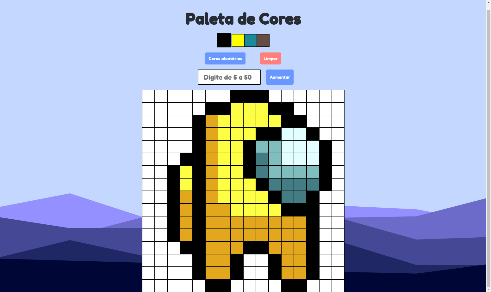

># Pixel Art

## Sobre o projeto
        Projeto consiste em uma tela para pixel art. Criado no módulo de fundamentos da Trybe com o objetivo de aperfeiçoar minha manipulação com o DOM e web storage.

># 🔗 [Acesse clicando aqui!](https://luandersonalvesdev.github.io/pixel-art)

## 👨‍💻 APRENDIZADO
- Adição de tags no HTML pelo Javascript através do DOM.
- Manipulação de dados do web storage.

## 🛠️ TECNOLOGIAS USADAS 
- HTML
- CSS
- JavaScript
- GIT e Github

## CONTATO

https://linkedin.com/in/luandersonalvesdev